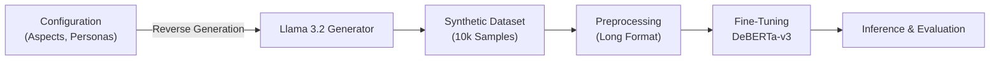

# Project SocioScope 🔭
### Aspect-Based Sentiment Analysis for Socio-Economic Discourse

**SocioScope** is a Deep Learning project designed to detect and analyze public sentiment regarding complex socio-economic issues (e.g., Cost of Living, Personal Security) on social media.

---

## 1. 🎯 Project Motivation & Problem Statement

**The Problem:**
Standard Aspect-Based Sentiment Analysis (ABSA) datasets are predominantly focused on commercial products (e.g., laptops, restaurants). There is a significant scarcity of high-quality, labeled datasets suitable for analyzing complex, unstructured socio-economic discourse.

**Our Motivation:**
We aim to bridge this gap by developing a robust pipeline that can identify specific aspects within a single tweet and determine the sentiment (Positive, Negative, or Neutral) towards them. This tool can be used to gauge public opinion on policy changes, economic shifts, and social issues.

## 2. 🖼️ Visual Abstract

The following diagram illustrates our End-to-End Pipeline:

## 3. 💾 Datasets Used
Since no suitable dataset existed, we created our own:

* **Source:** 100% Synthetic, generated via Large Language Models.

* **Size:** 10,000 Labeled Tweets.

* **Format:** JSONL (each line contains a tweet and a vector of sentiments).

* **Class Balance:** The dataset was generated to ensure a diverse distribution of sentiment across 10 key aspects (e.g., Taxation, Healthcare, Education).

## 4. 🧬 Data Augmentation & Generation Methods
To ensure 100% label accuracy, we employed a **"Reverse Generation"** approach. Instead of generating text and then labeling it, we defined the mathematical ground truth before the text was created.

#### The Generation Pipeline:
1. **Vector Definition:** We select 1-2 active aspects (e.g., `Healthcare: -1`) and leave the rest as 0.

2. **Prompt Engineering:** We inject **7 Personas** (e.g., "Struggling Student", "Political Activist") and **6 Styles** (e.g., "Sarcastic", "Formal") to ensure linguistic diversity.

3. **Execution:** Using **Llama 3.2** (via Ollama), we generate tweets that match the pre-defined vector and persona.

#### Preprocessing & Negative Sampling:
To solve the "Sparse Aspect" problem (where most aspects are irrelevant in a single tweet), we transformed the data:

* **Format Conversion:** From Wide (one column per aspect) to Long format.

* **Negative Sampling:** For every active aspect in a tweet, we sampled exactly one inactive aspect and labeled it as **Class 1 (Not Mentioned)**. This taught the model to actively filter out irrelevant noise.

## 5. 📥 Input/Output Examples
**Input (Raw Text):**

"The taxes are killing us, but at least the streets are safe to walk at night."

**Model Output (Inference):** The model analyzes all 10 aspects and returns:
| Aspect | Predicted Class | Confidence | Interpretation |
| :--- | :---: | :---: | :--- |
| **Taxation** | `0` | 0.72 | **Negative** |
| **Personal Security** | `2` | 0.78 | **Positive** |
| **Education** | `1` | 0.98 | *Not Mentioned* |
| **Cost of Living** | `1` | 0.96 | *Not Mentioned* |
| ... | ... |... | ... |

## 6. ⚙️ Models and Pipelines Used

* **Base Model:** `yangheng/deberta-v3-base-absa-v1.1`.
* **Tokenizer:** DeBERTa-v3 AutoTokenizer.
* **Architecture:** Sequence Classification with 3 Output Labels:
    * `0`: Negative
    * `1`: Not Mentioned (Neutral/Irrelevant)
    * `2`: Positive

## 7. 🏋️ Training Process and Parameters

We fine-tuned the model using the Hugging Face `Trainer` API with a specific focus on preventing overfitting on synthetic data.

* **Learning Rate:** `1e-5` (Low LR for stability).
* **Batch Size:** 16.
* **Weight Decay:** `0.1` (Aggressive regularization).
* **Evaluation Strategy:** Steps (every 500 steps) instead of Epochs.
* **Optimization:** **Early Stopping** (patience=1) and `load_best_model_at_end=True`.

## 8. 📐 Metrics

We moved beyond simple Accuracy to capture the model's true performance on minority classes:

* **Macro F1-Score:** To ensure balanced performance across Positive, Negative, and Not Mentioned classes.
* **Multiclass ROC AUC:** To measure the model's ability to distinguish between classes at various thresholds.
* **Confusion Matrix:** To visualize specific misclassifications.

## 9. 🏆 Results

Our final model achieved robust performance, effectively solving the noise filtering challenge:

* **Relevance Detection (ROC AUC):** **0.98** (The model perfectly identifies when an aspect is NOT mentioned).
* **Sentiment Classification (ROC AUC):** **>0.92** (High precision in distinguishing Positive vs. Negative).
* **Visual Validation:**
    * **t-SNE:** Showed clear geometric separation between "Not Mentioned" embeddings (noise) and active sentiment clusters.
    * **Confusion Matrix:** Confirmed low False Positive rates and high recall for active aspects.

## 10. 📂 Repository Structure

* `Data/`: Contains the generated synthetic datasets (JSONL format) used for training and testing.
* `Results/`: Stores the evaluation outputs, including predictions from our fine-tuned DeBERTa model and zero-shot baselines from Gemma 3.
* `Code/`: Holds all Jupyter Notebooks and Python scripts for data generation, preprocessing, EDA, training, and inference.
* `Visuals/`: Contains generated plots and graphs (ROC curves, t-SNE projections).
* `Slides/`: Includes the project presentation decks and related materials.
* `final_absa_model/`: The final fine-tuned model artifacts, including weights and configuration files.

## 11. 👥 Team Members
* **Pavel Fadeev**
* **Ofir Fichman**
* **Israel Peled**
